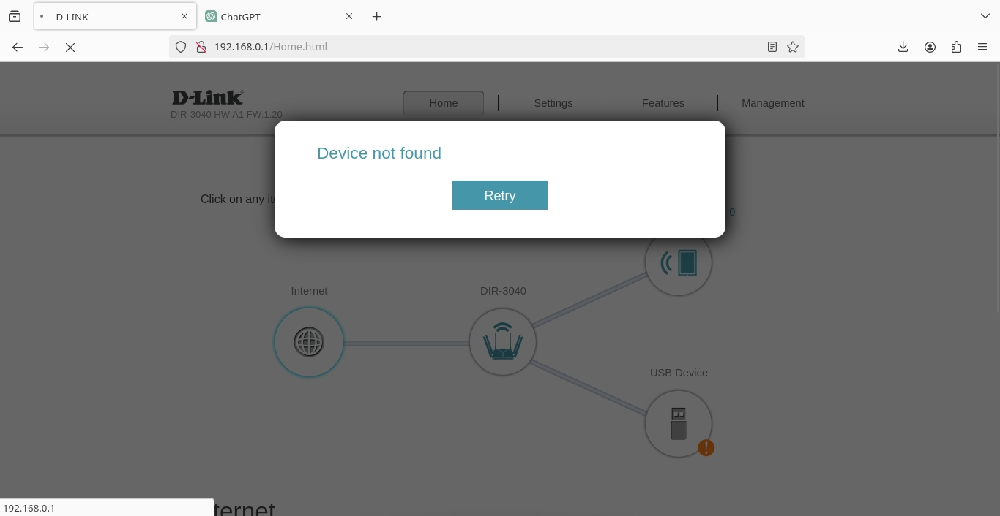

# dir-3040 Denial of Service
Dir-3060 might also be affected as they share many components from same firmware.

Tested on latest firmware 1.20b03a hotfix

ftp server user access page by default is configured for any user with write privileges to write directly to ram instead of restricting to usb drives only.

There are no out of bound or buffer overflow checks in place in latest firmware for this issue.

After writing(filling) available memory system will crash and reboot.

User doesnt need to have administrator privileges to perform the attack.

proof of concept in detail with pictures below

D-link was contacted and strongly denied presence of the issue because they couldnt reproduce the issue. All other nonsensical resolutions were denied by me.

Showing default config for new user

Check for available memory in syslog

Creating 300mb file with dd accessing ftp as a user with read and write privileges changing to / and writing the file

As soon as available free memory is filled system is crashing and rebooting

This can be reproduced with any size usb flash.

There is no patch on solution because as per D-link USA they cant reproduce the issue.
